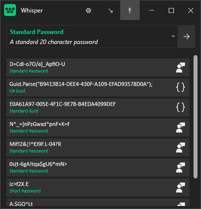
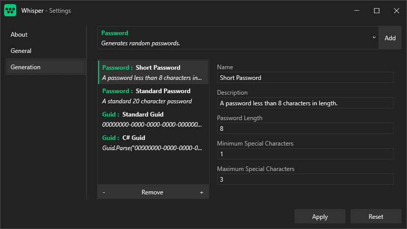

 

Whisper
=======

Whisper is a provider-driven "clipboard content generator" for Windows. It runs in the background and provides content directly to your clipboard. New Passwords, Guids, and Random Numbers are bundled with the core application, but this could be extended to anything - Number Plates, Harry Potter Quotes, or Pokemon Names for example.

Whisper content is configurable within the bounds of the content providers' constraints, and can be configured into *Presets*. *Presets* can then be used within the application shell to generate content accordingly.

Whisper can be minimised to run in the shell for easy access if desired. Future updates will likely add more functionality for background operation.

Installation
------------

The latest release can be sourced from the [*Releases* page](https://github.com/gpriaulx/Whisper/releases). CI builds are available via [AppVeyor](https://ci.appveyor.com/project/gpriaulx/whisper). 

> Note: The MSI may be flakey when upgrading. Until this is reviewed it may be necessary to manually uninstall previous versions before installing newer versions. This should not result in configuration loss outside of general compatibility.

Feedback
--------

Feedback and suspected issues can be provided via [*issues*](https://github.com/gpriaulx/Whisper/issues). 